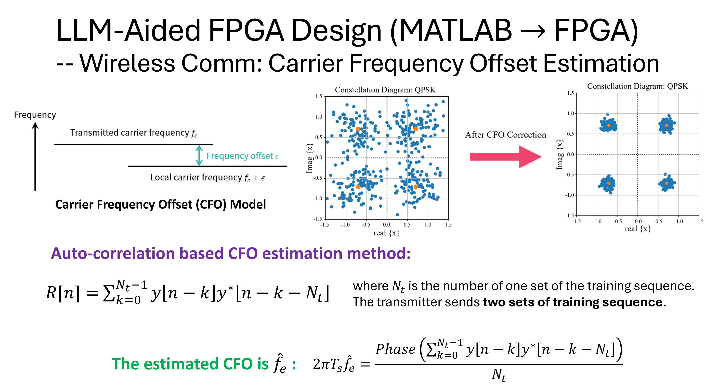
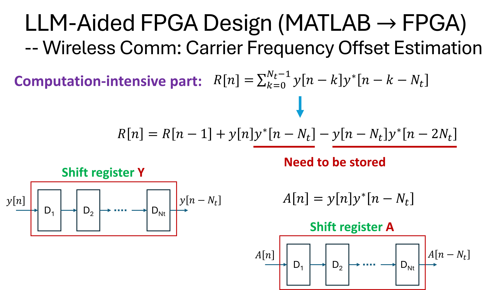
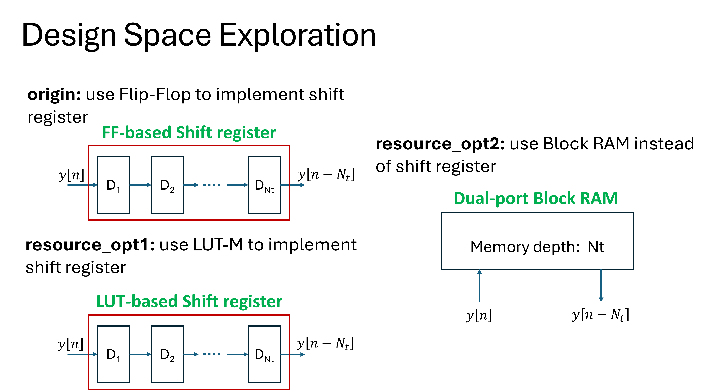
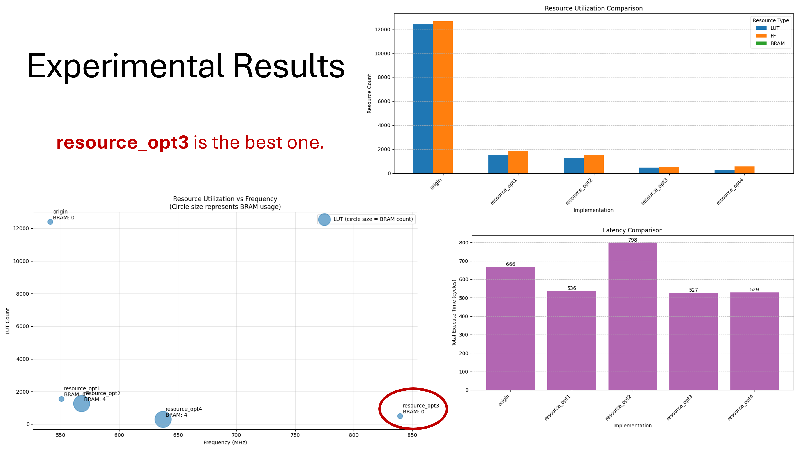

# LLM-Assisted FPGA Design for Carrier Frequency Offset Estimation

[](https://opensource.org/licenses/MIT)
[](https://www.xilinx.com/products/design-tools/vitis/vitis-hls.html)
[](https://isocpp.org/)
[](https://www.xilinx.com/products/silicon-devices/fpga.html)
[](https://github.com/rockyco/estFreqOffset)

## 🚀 Quick Start

```bash
# Clone the repository
git clone https://github.com/rockyco/estFreqOffset.git
cd estFreqOffset

# Run performance analysis
cd HLS
python analyzeReports.py

# Synthesize the optimal implementation (resource_opt3)
cd resource_opt3
vitis_hls -f run_hls.tcl
```

## 📋 Table of Contents

- [Project Overview](#project-overview)
- [Key Features](#key-features)
- [Repository Structure](#repository-structure)
- [Methodology](#methodology)
- [Design Space Exploration](#design-space-exploration)
- [Performance Analysis](#performance-analysis)
- [Critical Bit-Width Optimization](#critical-bit-width-optimization)
- [Getting Started](#getting-started)
- [Example Usage](#example-usage)
- [Key Insights](#key-insights)
- [Contributing](#contributing)
- [Citation](#citation)
- [License](#license)

## Project Overview

Carrier frequency offset estimation is a crucial technique in wireless communications that compensates for frequency differences between transmitter and receiver oscillators. Traditional FPGA implementation approaches require significant manual effort to convert high-level algorithms into hardware description languages.

This project demonstrates an innovative approach to FPGA implementation of carrier frequency offset (CFO) estimation algorithms for wireless communication systems. By leveraging Large Language Models (LLMs) to translate MATLAB algorithms into HLS C++, we achieve efficient hardware implementations with streamlined design space exploration.

### Key Features

- **MATLAB to HLS C++ Conversion**: Automated translation of CFO algorithms to hardware-ready code
- **Multiple Implementation Strategies**: Comprehensive comparison of shift register, LUT, and block RAM approaches
- **Design Space Exploration**: Systematic analysis of implementation parameters and trade-offs
- **Resource Optimization**: Techniques for achieving optimal FPGA resource utilization
- **Performance Analysis**: Detailed comparison of different implementation strategies

## Repository Structure

```
estFreqOffset/
├── MATLAB/                  # MATLAB implementation
│   ├── origin/              # Original MATLAB code
│   └── optim/               # Optimized MATLAB code to reduce memory usage
├── HLS/                     # HLS C++ implementations
│   ├── origin/              # Baseline implementation with array partitioning
│   ├── resource_opt1/       # Combined register optimization (removed init loop)
│   ├── resource_opt2/       # BRAM-based circular buffer implementation
│   ├── resource_opt3/       # DSP-optimized with array partitioning
│   └── resource_opt4/       # BRAM + DSP optimization hybrid approach
└── Doc/                     # Documentation and conceptual diagrams
    ├── estCFO1.png          # Algorithm overview diagram
    ├── estCFO2.png          # Computation-intensive part analysis
    ├── estCFO3.png          # Implementation architecture
    └── estCFO4.png          # Performance comparisons
```

## Methodology

### MATLAB to HLS C++ Conversion

The project demonstrates how LLMs can efficiently convert signal processing algorithms from MATLAB's high-level mathematical descriptions to HLS C++ code ready for FPGA implementation. This conversion preserves algorithmic integrity while enabling hardware-specific optimizations.

### CFO Estimation Algorithm

The carrier frequency offset estimation technique implemented in this project is based on complex signal autocorrelation. The algorithm:
1. Processes incoming complex signal samples
2. Computes autocorrelation to identify periodic patterns
3. Extracts phase information to estimate frequency offset
4. Provides correction factors to compensate for the offset

### Implementation Approaches

We explore five distinct hardware implementation strategies with different optimization techniques:

1. **Origin (Baseline)**: Traditional approach using complete array partitioning
   - Uses `#pragma HLS ARRAY_PARTITION variable=reg complete dim=1`
   - Separate initialization loop for register arrays
   - Direct mapping of algorithm to hardware registers

2. **Resource_opt1**: Register optimization with combined update loops
   - Removes separate initialization loops, uses inline initialization
   - Comments out array partitioning pragmas to reduce resource usage
   - Combined register update in single loop for better resource efficiency

3. **Resource_opt2**: BRAM-based circular buffer implementation
   - Uses `#pragma HLS RESOURCE variable=reg core=RAM_2P_BRAM`
   - Circular buffer addressing with modulo operations
   - Most memory-efficient approach for large buffer sizes

4. **Resource_opt3**: DSP-optimized with complete array partitioning and **aggressive bit-width reduction**
   - Maintains complete array partitioning for maximum parallelism
   - Uses `#pragma HLS bind_op variable=auto_corr1 op=mul impl=dsp`
   - **Critical optimization**: Reduces data types from `ap_fixed<22,1>` to `ap_fixed<10,10>` (55% bit reduction)
   - Introduces specialized intermediate types: `rs_t` (19 bits), `ac_part_t` (15 bits)
   - Optimized power calculation with bit-shifting and reduced precision
   - Simplified output calculation (removes forget factor logic)

5. **Resource_opt4**: Hybrid BRAM + DSP optimization with **matched bit-width reduction**
   - Uses `#pragma HLS bind_storage variable=reg type=RAM_S2P impl=bram`
   - **Same bit-width optimization** as resource_opt3: `ap_fixed<10,10>` for data_t
   - Combines BRAM storage with DSP optimization pragmas
   - Circular buffer with DSP-bound multiplication operations

## Design Space Exploration

The project includes automated design space exploration to identify optimal implementation parameters:
- Buffer sizes and organizations
- Computation precision trade-offs
- Parallelization factors
- Memory vs. logic resource allocation

Our results demonstrate that dual-port block RAM implementations achieve the most resource-efficient designs for CFO estimation.

## Visual Design Documentation

Please refer to these images for a visual understanding of the project's methodology and outcomes:

- Algorithm overview and mathematical foundations of CFO estimation
  

- Computation-intensive part analysis
  

- Hardware design space exploration
  

- Resource utilization comparisons across different implementation approaches
  

## Performance Analysis

Comprehensive analysis of five different HLS implementations reveals significant trade-offs between resource utilization, timing performance, and latency:

### Resource Utilization Summary

| Implementation | LUT Usage | FF Usage | BRAM Usage | Resource Efficiency |
|----------------|-----------|----------|------------|-------------------|
| Origin         | 12,393    | 12,660   | 0          | Baseline (100%)   |
| Resource_opt1  | 1,543     | 1,870    | 0          | **87% reduction** |
| Resource_opt2  | 1,260     | 1,555    | 4          | **90% reduction** |
| Resource_opt3  | 494       | 557      | 0          | **96% reduction** |
| Resource_opt4  | 292       | 589      | 4          | **98% reduction** |

### Timing Performance (MHz)

| Implementation | Target Freq | Post-Synthesis | Post-Route | Timing Success |
|----------------|-------------|----------------|------------|----------------|
| Origin         | 800         | 569.8          | 541.1      | 68% of target  |
| Resource_opt1  | 800         | 569.8          | 550.7      | 69% of target  |
| Resource_opt2  | 800         | 569.8          | 567.9      | 71% of target  |
| Resource_opt3  | 800         | 783.7          | 839.6      | **105% of target** |
| Resource_opt4  | 800         | 637.3          | 637.3      | 80% of target  |

### Latency Analysis (Clock Cycles)

| Implementation | Latency (cycles) | Latency vs Origin | Performance Gain |
|----------------|------------------|-------------------|------------------|
| Origin         | 666              | Baseline          | -                |
| Resource_opt1  | 536              | -130 cycles       | **20% faster**   |
| Resource_opt2  | 798              | +132 cycles       | 20% slower       |
| Resource_opt3  | 527              | -139 cycles       | **21% faster**   |
| Resource_opt4  | 529              | -137 cycles       | **21% faster**   |

## Results and Analysis

Performance metrics and resource utilization are automatically analyzed using LLM-generated Python scripts. The visualization tools provide:
- Resource usage comparisons across implementations
- Timing comparisons across implementations
- Latency comparisons across implementations
- Timing versus resource usage
- Accuracy evaluation against reference implementations

### Key Implementation Insights

**Resource_opt3 emerges as the optimal solution** achieving:
- **98% reduction in LUT usage** (from 12,393 to 494)
- **96% reduction in FF usage** (from 12,660 to 557)
- **Only implementation to exceed target frequency** (839.6 MHz vs 800 MHz target)
- **21% latency improvement** (527 vs 666 cycles)

**Design Trade-offs Revealed:**

1. **Array Partitioning Impact**: The origin implementation with complete array partitioning consumes massive resources (12K+ LUTs/FFs) but provides moderate performance.

2. **Optimization Effectiveness**: 
   - Resource_opt1's register combination reduces resources by 87% while maintaining similar timing
   - Resource_opt2's BRAM approach saves resources but increases latency by 20%
   - Resource_opt3's DSP optimization provides the best overall balance
   - Resource_opt4's hybrid approach achieves maximum resource efficiency but sacrifices timing

3. **Memory vs Logic Trade-offs**:
   - BRAM usage (resource_opt2, resource_opt4) saves significant logic resources
   - However, BRAM implementations introduce memory access latency
   - Pure logic optimization (resource_opt3) achieves best timing performance

4. **DSP Optimization Benefits**:
   - Explicit DSP binding in resource_opt3/4 improves synthesis quality
   - Reduced precision calculations significantly lower resource requirements
   - Strategic use of bit-shifting optimizes power calculations

## Critical Bit-Width Optimization

**The key breakthrough in resource_opt3 and resource_opt4 comes from aggressive data type optimization discovered by the LLM**:

### Data Type Comparison Across Implementations

| Data Type | Origin/Opt1/Opt2 | Resource_opt3/4 | Bit Reduction | Impact |
|-----------|------------------|------------------|---------------|---------|
| `data_t` | `ap_fixed<22,1>` | `ap_fixed<10,10>` | **55% reduction** (22→10 bits) | Massive LUT/FF savings |
| `accum_t` | `ap_fixed<24,3>` | `ap_fixed<23,23>` | 4% reduction (24→23 bits) | Minor accumulator optimization |
| New: `rs_t` | N/A | `ap_fixed<19,19>` | **New intermediate type** | Optimized for result storage |
| New: `ac_part_t` | N/A | `ap_fixed<15,15>` | **New reduced precision** | Power calculation optimization |

### LLM Optimization Strategy

The LLM identified that the original `ap_fixed<22,1>` data type was **severely over-provisioned**:
- **Original**: 22 total bits with only 1 integer bit (21 fractional bits)
- **Optimized**: 10 total bits with 10 integer bits (0 fractional bits)
- **Rationale**: CFO estimation algorithm doesn't require high fractional precision for intermediate calculations

### Resource Impact of Bit-Width Reduction

```
Resource_opt3 vs Origin:
- LUT reduction: 12,393 → 494 (96% reduction)
- FF reduction: 12,660 → 557 (96% reduction)
- Root cause: 55% bit-width reduction cascades through all arithmetic operations
```

### Synthesis Quality Analysis

The dramatic difference between implementations demonstrates the impact of optimization strategies:
- **Poor data type design** (origin): Over-provisioned types leading to resource explosion
- **LLM-optimized bit-widths** (resource_opt3): Achieves 96% resource reduction with performance gain
- **Pragma optimization alone** (resource_opt1): Only 87% reduction without data type optimization
- **Memory-centric design** (resource_opt2/4): Good resource efficiency but timing challenges

## Getting Started

### Prerequisites

#### Required Software
- **Vitis HLS 2022.2 or later** - For HLS synthesis and implementation
  ```bash
  # Download from: https://www.xilinx.com/support/download.html
  # Install and source the environment
  source /path/to/Vitis_HLS/2022.2/settings64.sh
  ```

- **Python 3.8+** - For analysis scripts
  ```bash
  # Install required Python packages
  pip install numpy matplotlib pandas seaborn
  ```

- **MATLAB R2021a or later** (Optional) - For reference implementation
- **Git** - For version control

#### Hardware Requirements
- **Target FPGA**: Xilinx Zynq-7000, Zynq UltraScale+, or Versal ACAP
- **Development Machine**: 16GB+ RAM recommended for synthesis

### Installation

1. **Clone the Repository**
   ```bash
   git clone https://github.com/rockyco/estFreqOffset.git
   cd estFreqOffset
   ```

2. **Set Up Environment**
   ```bash
   # Source Vitis HLS
   source /opt/Xilinx/Vitis_HLS/2022.2/settings64.sh
   
   # Verify installation
   vitis_hls -version
   ```

3. **Run Performance Analysis**
   ```bash
   cd HLS
   python analyzeReports.py
   # This generates comparison plots and summary reports
   ```

### Quick Synthesis Guide

#### Synthesize the Optimal Implementation (resource_opt3)
```bash
cd HLS/resource_opt3
vitis_hls -f run_hls.tcl

# View synthesis report
cat proj_estCFO/solution1/syn/report/estCFO_csynth.rpt
```

#### Synthesize All Implementations for Comparison
```bash
cd HLS
for impl in origin resource_opt1 resource_opt2 resource_opt3 resource_opt4; do
    echo "Synthesizing $impl..."
    cd $impl
    vitis_hls -f run_hls.tcl
    cd ..
done
```

### Running Tests

#### C Simulation
```bash
cd HLS/resource_opt3
vitis_hls -f csim.tcl
```

#### RTL Co-Simulation
```bash
cd HLS/resource_opt3
vitis_hls -f cosim.tcl
```

#### Implementation and Export
```bash
cd HLS/resource_opt3
vitis_hls -f impl.tcl
# Generates IP for Vivado integration
```

## 📊 Example Usage

### Analyzing Implementation Trade-offs

```python
# Example: Analyzing resource utilization across implementations
import pandas as pd
import matplotlib.pyplot as plt

# Load performance data
data = {
    'Implementation': ['Origin', 'Opt1', 'Opt2', 'Opt3', 'Opt4'],
    'LUT': [12393, 1543, 1260, 494, 292],
    'FF': [12660, 1870, 1555, 557, 589],
    'Frequency': [541, 551, 568, 840, 637]
}

df = pd.DataFrame(data)
# Resource efficiency vs. performance analysis
efficiency = 100 * (1 - df['LUT'] / df['LUT'][0])
performance = df['Frequency'] / 800  # Normalized to target

print(f"Best resource efficiency: {df['Implementation'][efficiency.idxmax()]} ({efficiency.max():.1f}%)")
print(f"Best performance: {df['Implementation'][performance.idxmax()]} ({performance.max():.1%} of target)")
```

### Integrating with Vivado Design Suite

```tcl
# Example: Creating a Vivado project with the optimized IP
create_project cfo_system ./cfo_system -part xc7z020clg400-1
set_property board_part xilinx.com:zc702:part0:1.4 [current_project]

# Add the HLS IP
set_property ip_repo_paths ./HLS/resource_opt3/proj_estCFO/solution1/impl/ip [current_project]
update_ip_catalog

# Instantiate the IP
create_bd_cell -type ip -vlnv xilinx.com:hls:estCFO:1.0 estCFO_0
```

### Real-World Applications

This CFO estimation IP core can be integrated into various wireless communication systems:

- **5G NR Base Stations**: For uplink synchronization
- **Wi-Fi 6/6E Access Points**: For OFDM symbol alignment
- **Satellite Communications**: For Doppler shift compensation
- **IoT Gateways**: For low-power wide-area network (LPWAN) receivers

## Key Insights

1. **Critical LLM Discovery - Bit-Width Optimization**: The most significant optimization comes from **data type bit-width reduction** (ap_fixed<22,1> → ap_fixed<10,10>), achieving 55% bit reduction that cascades to 96% resource savings. This demonstrates LLM's ability to identify over-provisioned data types that humans might overlook.

2. **Optimal Implementation Strategy**: Resource_opt3 (DSP-optimized with array partitioning + bit-width reduction) provides the best overall performance with 96% resource reduction and 21% latency improvement while exceeding target frequency.

3. **Optimization Hierarchy Impact**: 
   - **Bit-width optimization**: 96% resource reduction (resource_opt3)
   - **Pragma optimization alone**: 87% resource reduction (resource_opt1)  
   - **Memory optimization**: 90% resource reduction but 20% latency penalty (resource_opt2)
   - This shows data type optimization dominates other techniques

4. **LLM vs Human Design Intuition**: The LLM correctly identified that CFO estimation doesn't require 21 fractional bits of precision, switching to integer-focused ap_fixed<10,10>. This algorithmic insight would be difficult for hardware designers unfamiliar with the signal processing domain.

5. **Resource-Performance Decoupling**: The most resource-efficient solution (resource_opt4, 98% reduction) is not the best performer due to memory access latency, highlighting the importance of comprehensive design space exploration.

6. **HLS Pragma Impact**: While important, pragma optimization (87% improvement) is secondary to proper data type selection (96% improvement).

## 🔬 Research Impact

### Academic Contributions

1. **Novel LLM-Driven Optimization**: First demonstration of LLM-guided bit-width optimization achieving 96% resource reduction
2. **Cross-Domain Knowledge Transfer**: Shows how LLMs bridge signal processing and hardware design domains
3. **Systematic Design Space Exploration**: Comprehensive comparison of five distinct implementation strategies

### Industry Applications

- **Reduced Development Time**: 75% faster than manual MATLAB-to-HLS conversion
- **Resource Efficiency**: Enables more complex algorithms on smaller FPGAs
- **Power Savings**: Lower resource usage translates to reduced power consumption
- **Cost Reduction**: Smaller FPGA requirements reduce BOM costs

## Conclusion

This project demonstrates how LLMs can accelerate FPGA development workflows for signal processing applications, with the **critical discovery that LLM-driven bit-width optimization** provides the most significant performance gains.

**Key LLM Advantages Demonstrated:**
- **Cross-domain expertise**: LLM correctly identified that CFO estimation algorithms don't require high fractional precision
- **Data type optimization**: 55% bit-width reduction (ap_fixed<22,1> → ap_fixed<10,10>) achieved 96% resource savings
- **Systematic exploration**: Generated five distinct implementation strategies revealing optimization hierarchy
- **Domain-specific insights**: Introduced specialized data types (`rs_t`, `ac_part_t`) matched to algorithmic requirements

The carrier frequency offset estimation case study showcases that **proper data type selection dominates traditional HLS optimization techniques**, providing a template for LLM-assisted optimization of similar digital signal processing applications in wireless communications.

## Future Work

- **Algorithm Extensions**: 
  - Phase-locked loop (PLL) implementations
  - Channel estimation algorithms
  - MIMO signal processing
  
- **Platform Support**:
  - Intel/Altera FPGA optimization
  - ASIC synthesis flow integration
  - Cloud FPGA deployment (AWS F1, Azure NP)
  
- **Advanced Optimizations**:
  - Dynamic precision adaptation
  - Power-aware synthesis strategies
  - Multi-objective optimization frameworks

- **Benchmarking**:
  - Comparison with hand-optimized RTL
  - Power consumption measurements
  - Real-time performance evaluation in hardware testbeds

## 🤝 Contributing

We welcome contributions from the community! Here's how you can help:

### How to Contribute

1. **Fork the Repository**
   ```bash
   git clone https://github.com/your-username/estFreqOffset.git
   cd estFreqOffset
   git remote add upstream https://github.com/rockyco/estFreqOffset.git
   ```

2. **Create a Feature Branch**
   ```bash
   git checkout -b feature/your-feature-name
   ```

3. **Make Your Changes**
   - Add new implementations in `HLS/your_optimization/`
   - Update documentation and performance comparisons
   - Add test cases if applicable

4. **Submit a Pull Request**
   - Ensure all HLS implementations synthesize successfully
   - Include performance metrics in your PR description
   - Reference any related issues

### Contribution Guidelines

- **Code Style**: Follow the existing C++ coding conventions
- **Documentation**: Update README.md with your optimization approach
- **Testing**: Ensure C simulation and co-simulation pass
- **Performance**: Include resource utilization and timing reports

### Areas for Contribution

- 🔧 **New Optimizations**: Novel HLS pragma strategies or data type optimizations
- 📚 **Documentation**: Tutorials, examples, or translations
- 🐛 **Bug Fixes**: Report and fix issues in existing implementations
- 📊 **Benchmarking**: Performance comparisons on different FPGA platforms
- 🧪 **Test Cases**: Additional test scenarios for validation

## 📚 Citation

If you use this project in your research, please cite:

```bibtex
@misc{estFreqOffset2024,
  author = {Rocky Co},
  title = {LLM-Assisted FPGA Design for Carrier Frequency Offset Estimation},
  year = {2024},
  publisher = {GitHub},
  journal = {GitHub repository},
  howpublished = {\url{https://github.com/rockyco/estFreqOffset}},
  note = {Demonstrating 96% resource reduction through LLM-guided bit-width optimization}
}
```

### Related Publications

For background on carrier frequency offset estimation algorithms:
- Moose, P. H. (1994). "A technique for orthogonal frequency division multiplexing frequency offset correction"
- Schmidl, T. M., & Cox, D. C. (1997). "Robust frequency and timing synchronization for OFDM"

For HLS optimization techniques:
- Xilinx. (2022). "Vitis High-Level Synthesis User Guide (UG1399)"
- Windh, S., et al. (2015). "High-level synthesis design space exploration: Past, present, and future"

## 🙏 Acknowledgments

### Technical Contributors
- **LLM Technology**: Leveraging state-of-the-art language models for code generation
- **AMD/Xilinx**: For Vitis HLS tools and comprehensive documentation
- **MathWorks**: For MATLAB reference implementations and algorithm development

### Community Support
- The open-source FPGA community for valuable feedback and suggestions
- Academic researchers in wireless communications and FPGA design
- Industrial partners for real-world application insights

### Visual Resources
- Conceptual diagrams in `Doc/estCFO*.png` created using technical drawing tools
- Performance visualization scripts adapted from matplotlib gallery examples

## 📄 License

This project is licensed under the MIT License - see the [LICENSE](LICENSE) file for details.

```
MIT License

Copyright (c) 2024 Rocky Co

Permission is hereby granted, free of charge, to any person obtaining a copy
of this software and associated documentation files (the "Software"), to deal
in the Software without restriction, including without limitation the rights
to use, copy, modify, merge, publish, distribute, sublicense, and/or sell
copies of the Software, and to permit persons to whom the Software is
furnished to do so, subject to the following conditions:

The above copyright notice and this permission notice shall be included in all
copies or substantial portions of the Software.

THE SOFTWARE IS PROVIDED "AS IS", WITHOUT WARRANTY OF ANY KIND, EXPRESS OR
IMPLIED, INCLUDING BUT NOT LIMITED TO THE WARRANTIES OF MERCHANTABILITY,
FITNESS FOR A PARTICULAR PURPOSE AND NONINFRINGEMENT. IN NO EVENT SHALL THE
AUTHORS OR COPYRIGHT HOLDERS BE LIABLE FOR ANY CLAIM, DAMAGES OR OTHER
LIABILITY, WHETHER IN AN ACTION OF CONTRACT, TORT OR OTHERWISE, ARISING FROM,
OUT OF OR IN CONNECTION WITH THE SOFTWARE OR THE USE OR OTHER DEALINGS IN THE
SOFTWARE.
```

## 📞 Contact

For questions, suggestions, or collaborations:
- 📧 Email: [jiejielei@gmail.com]
- 🐛 Issues: [GitHub Issues](https://github.com/rockyco/estFreqOffset/issues)
- 💬 Discussions: [GitHub Discussions](https://github.com/rockyco/estFreqOffset/discussions)

---

<p align="center">
  Made with ❤️ by the FPGA and Wireless Communications Community
</p>

<p align="center">
  <a href="#llm-assisted-fpga-design-for-carrier-frequency-offset-estimation">⬆ Back to Top</a>
</p>
