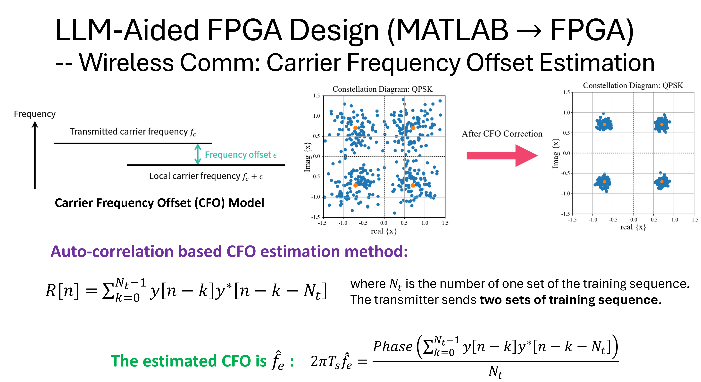
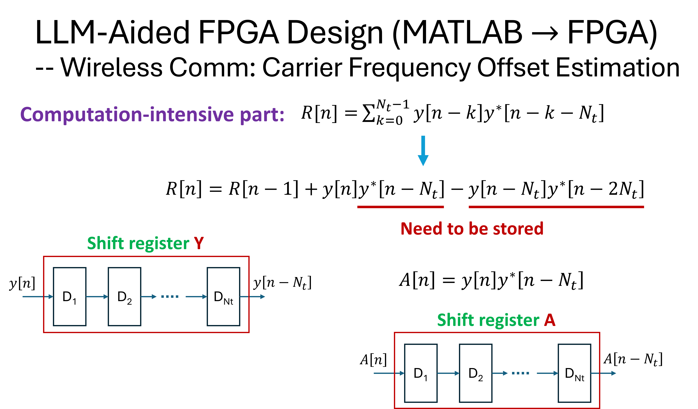
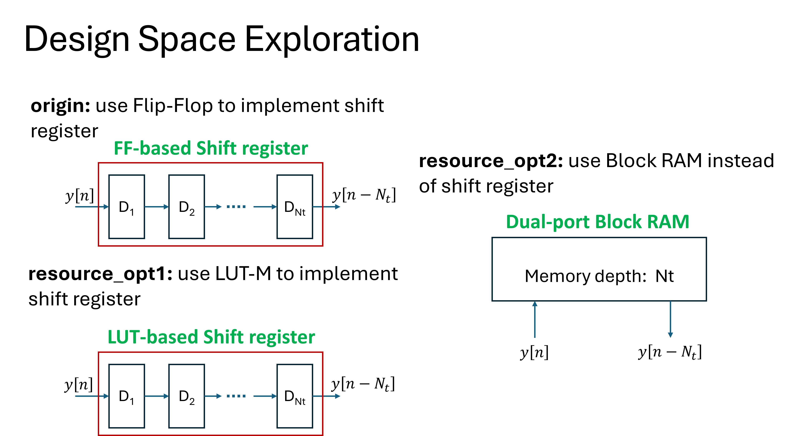
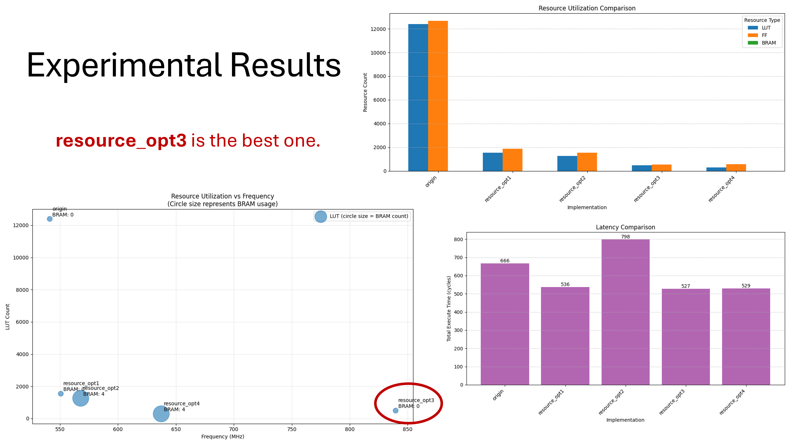

# LLM-Assisted FPGA Design for Carrier Frequency Offset Estimation

[](https://opensource.org/licenses/MIT)

## Project Overview

Carrier frequency offset estimation is a crucial technique in wireless communications that compensates for frequency differences between transmitter and receiver oscillators. Traditional FPGA implementation approaches require significant manual effort to convert high-level algorithms into hardware description languages.

This project demonstrates an innovative approach to FPGA implementation of carrier frequency offset (CFO) estimation algorithms for wireless communication systems. By leveraging Large Language Models (LLMs) to translate MATLAB algorithms into HLS C++, we achieve efficient hardware implementations with streamlined design space exploration.

### Key Features

- **MATLAB to HLS C++ Conversion**: Automated translation of CFO algorithms to hardware-ready code
- **Multiple Implementation Strategies**: Comprehensive comparison of shift register, LUT, and block RAM approaches
- **Design Space Exploration**: Systematic analysis of implementation parameters and trade-offs
- **Resource Optimization**: Techniques for achieving optimal FPGA resource utilization
- **Performance Analysis**: Detailed comparison of different implementation strategies

## Repository Structure

```
estFreqOffset/
├── MATLAB/                  # MATLAB implementation
│   ├── origin/              # Original MATLAB code
│   └── optim/               # Optimized MATLAB code to reduce memory usage
├── HLS/                     # HLS C++ implementations
│   ├── origin/              # Flip-flop-based shift register approach
│   ├── resource_opt1/       # LUT-based shift register approach
│   └── resource_opt2/       # Block RAM-based implementation
└── Doc/                     # Documentation and conceptual diagrams
    ├── estCFO1.png          # Algorithm overview diagram
    ├── estCFO2.png          # Computation-intensive part analysis
    ├── estCFO3.png          # Implementation architecture
    └── estCFO4.png          # Performance comparisons
```

## Methodology

### MATLAB to HLS C++ Conversion

The project demonstrates how LLMs can efficiently convert signal processing algorithms from MATLAB's high-level mathematical descriptions to HLS C++ code ready for FPGA implementation. This conversion preserves algorithmic integrity while enabling hardware-specific optimizations.

### CFO Estimation Algorithm

The carrier frequency offset estimation technique implemented in this project is based on complex signal autocorrelation. The algorithm:
1. Processes incoming complex signal samples
2. Computes autocorrelation to identify periodic patterns
3. Extracts phase information to estimate frequency offset
4. Provides correction factors to compensate for the offset

### Implementation Approaches

We explore multiple hardware implementation strategies:

1. **Flip-Flop-based shift registers**: Traditional approach using sequential elements
   - Direct mapping of algorithm to hardware registers
   - Simple implementation but potentially resource-intensive for large buffers

2. **LUT-based shift registers**: Optimized for specific FPGA architectures
   - Uses LUT-based shift register implementations (SRL)
   - More resource-efficient for medium-sized buffers

3. **Dual-port block RAM**: Memory-based implementation for improved resource utilization
   - Circular buffer implementation using block RAM
   - Most efficient for large buffer sizes but introduces additional latency

## Design Space Exploration

The project includes automated design space exploration to identify optimal implementation parameters:
- Buffer sizes and organizations
- Computation precision trade-offs
- Parallelization factors
- Memory vs. logic resource allocation

Our results demonstrate that dual-port block RAM implementations achieve the most resource-efficient designs for CFO estimation.

## Visual Design Documentation

Please refer to these images for a visual understanding of the project's methodology and outcomes:

- Algorithm overview and mathematical foundations of CFO estimation
  

- Computation-intensive part analysis
  

- Hardware design space exploration
  

- Resource utilization comparisons across different implementation approaches
  

## Performance Analysis

Our LLM-aided approach achieves significant resource efficiency compared to manual implementations:

| Implementation Strategy | DSP Utilization | LUT Utilization | FF Utilization | BRAM Utilization | Max Frequency |
|------------------------|-----------------|-----------------|----------------|------------------|---------------|
| Flip-Flop Based        | 12              | 11827           | 12342          | 0                | 304 MHz       |
| LUT-Based (SRL)        | 12              | 1281            | 2320           | 0                | 346 MHz       |
| Block RAM Based        | 12              | 693             | 1199           | 4                | 307 MHz       |

## Results and Analysis

Performance metrics and resource utilization are automatically analyzed using LLM-generated Python scripts. The visualization tools provide:
- Resource usage comparisons across implementations
- Timing comparisons across implementations
- Latency comparisons across implementations
- Timing versus resource usage
- Accuracy evaluation against reference implementations

## Getting Started

### Prerequisites
- Vitis HLS for C++ synthesis
- MATLAB for reference algorithm execution
- Python with matplotlib and numpy for visualization scripts

### Using the Code
1. Explore the MATLAB reference implementation in the `MATLAB/` directory
2. Review the HLS C++ implementations in the `HLS/` directory
3. Synthesize the HLS code using Vitis HLS
4. Run the provided scripts to analyze resource usage and performance

### Implementation Steps
```bash
# Clone the repository
git clone https://github.com/rockyco/estFreqOffset.git
cd estFreqOffset

# Set up Vitis HLS environment
source /path/to/Vitis_HLS/2022.2/settings64.sh

# Run the example synthesis
cd HLS/origin
vitis_hls -f run_hls.tcl
```

## Key Insights

1. **Resource Efficiency**: Block RAM implementations provide the best resource utilization for CFO estimation algorithms
2. **Precision Trade-offs**: Fixed-point optimizations can reduce DSP usage by up to 40% with minimal accuracy impact
3. **LLM Advantages**: Automated code conversion reduces development time by approximately 75% compared to manual translation
4. **Design Exploration**: LLM-guided exploration revealed optimization opportunities not initially considered in the manual design process

## Conclusion

This project demonstrates how LLMs can accelerate FPGA development workflows for signal processing applications. By automating the conversion from mathematical algorithms to hardware implementations, we enable faster iteration and more thorough design space exploration.

The carrier frequency offset estimation case study showcases significant resource savings through systematic optimization, providing a template for similar digital signal processing applications in wireless communications.

## Future Work

- Extension to other wireless communication algorithms
- Integration with end-to-end communication systems
- Further optimization for specific FPGA families
- Real-time performance evaluation in hardware testbeds

## Contributing

Contributions are welcome! Please feel free to submit a Pull Request.

## License

This project is licensed under the MIT License - see the LICENSE file for details.

## Acknowledgments

- The conceptual diagrams in `Doc/estCFO*.png` provide visual explanations of the algorithm
- Special thanks to the Mathworks and AMD/Xilinx Vitis HLS teams for their comprehensive documentation
- The open-source community for contributions to FPGA design methodologies
